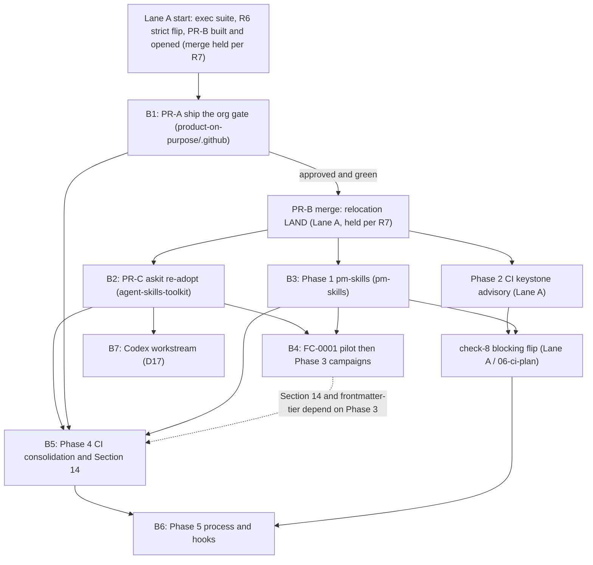

# Execution plan: two lanes and the program sequence

This is the master execution plan for the standards program. It operationalizes the locked planning package at [../standards-plan-roadmap/02-roadmap.md](../standards-plan-roadmap/02-roadmap.md) (the six-phase roadmap) and its decision record [../standards-plan-roadmap/03-decisions.md](../standards-plan-roadmap/03-decisions.md). It restates no decision rationale and allocates no version, ADR, or section numbers - those are owned by the roadmap and by the LAND process. This document decides only HOW the planned program runs from `agent-plugins`: which work is autonomous, which is gated, in what order, behind which gates.

The as-built starting point is [01-audit-2026-07-03.md](01-audit-2026-07-03.md); the outcomes and metrics this plan is measured against are [02-prd.md](02-prd.md).

## 1. The two-lane model

The full program (Phases 0 through 5 plus the Codex workstream) is planned. This program of work executes in two lanes so that autonomous in-repo progress never waits on a cross-repo decision, and no cross-repo change ever fires without an explicit maintainer go.

**Lane A - autonomous, agent-plugins-only.** Everything whose writes land entirely inside `agent-plugins`. Per R5 (Lane A autonomous merge), the orchestrator (Fable) merges Lane A PRs itself once the `validate` gate is green and a Codex adversarial review has been run and answered. Lane A membership:

- This execution suite (`docs/internal/execution/`) and its updates.
- R6 (branch protection strict flip): flip required-status-checks `strict:true` on `agent-plugins` `main`. `enforce_admins` stays `false` and is recorded as a documented residual risk in [09-risk-register.md](09-risk-register.md).
- R7 (PR-B staging): PR-B (agent-plugins atomic relocation LAND) is fully built and its PR opened during Lane A, but its merge is held until B1 (PR-A: ship the org gate) is approved and runs green.
- The Phase 2 CI keystone in [06-ci-plan.md](06-ci-plan.md): check 8 (re-pin conformance) and check 9 (truth-in-targeting, D10) land advisory in `scripts/validate-registry.mjs`, and the registry surfaces each member's `standard` and `tier`. All agent-plugins-only.

**Lane B - staged, approval-gated, cross-repo.** Per R2 (cross-repo gate), anything touching another repo (including `product-on-purpose/.github`) is a staged package carrying a recommendation, and nothing in it fires without the maintainer's per-package go. The seven packages:

- [B1 (PR-A: ship the org gate)](05-lane-b/B1-pr-a-org-gate.md) - the reusable `standards-gate.yml` in `product-on-purpose/.github`.
- [B2 (PR-C: askit re-adopt)](05-lane-b/B2-pr-c-askit-readopt.md) - repoint `agent-skills-toolkit` to the relocated runner, delete its copies last.
- [B3 (Phase 1: pm-skills)](05-lane-b/B3-phase-1-pm-skills.md) - close the two P0 holes so pm-skills can pin the Standard.
- [B4 (FC-0001 pilot and Phase 3)](05-lane-b/B4-fc-0001-and-phase-3.md) - the first fleet-orchestration pilot, then the coordinated scaffolding amendment and its push campaigns.
- [B5 (Phase 4: CI consolidation and Section 14)](05-lane-b/B5-phase-4-ci-and-section-14.md) - one shared `astro-site.yml`, Section 14 normative.
- [B6 (Phase 5: process and hooks)](05-lane-b/B6-phase-5-process-hooks.md) - release subsystem, hooks contract, exceptions, conventions.
- [B7 (Codex workstream, D17)](05-lane-b/B7-codex-workstream.md) - native Codex distribution.

**Why the split (R1).** R1 scopes this session to writes inside `agent-plugins` only. The split makes that scope a mechanical property, not a matter of discipline: Lane A is exactly the set Fable can complete and merge without leaving `agent-plugins`, and Lane B is exactly the set that cannot proceed without a per-package go. The dominant program risk is the two-week stall at the single authorization gate (see [09-risk-register.md](09-risk-register.md)); two lanes let Lane A make real, mergeable progress the moment the overall go lands, while Lane B stays correctly gated.

## 2. The cross-lane sequencing DAG

The order is set by dependency, not calendar, inheriting the roadmap's dependency spine. Cross-lane edges are the load-bearing ones: a Lane A merge can wait on a Lane B approval (PR-B merge waits on B1), and a Lane A flip can wait on a Lane B landing (the check-8 blocking flip waits on B3).

| Item | Lane | Repo(s) | Depends on | Unblocks | Gate |
|---|---|---|---|---|---|
| Exec suite | A | agent-plugins | audit committed | all planning | overall go |
| R6 strict flip | A | agent-plugins | overall go | serialization for every LAND | overall go |
| PR-B relocation LAND | A | agent-plugins | B1 approved and green (R7) | B2, B3, Phase 2 keystone, Phase 3 amendment | autonomous once B1 green plus Codex review |
| Phase 2 CI keystone (advisory) | A | agent-plugins | PR-B merge (singular Standard home) | check-8 blocking flip | autonomous |
| check-8 blocking flip | A | agent-plugins | B3 (all four can pin) | family listing conformance CI-enforced | autonomous once all four green |
| B1 (PR-A: ship the org gate) | B | product-on-purpose/.github | overall go | PR-B merge | per-package go |
| B2 (PR-C: askit re-adopt) | B | agent-skills-toolkit | PR-B merge | Phase 3 exemplar chain, B7 gate-verify | per-package go |
| B3 (Phase 1: pm-skills) | B | pm-skills | PR-B merge (final home to pin) | check-8 flip, Phase 3 conforming exemplar | per-package go |
| B4 (FC-0001 and Phase 3) | B | all four plus agent-plugins | B2, B3 | Phase 4 content | per-package go |
| B5 (Phase 4: CI and Section 14) | B | product-on-purpose/.github, all four, agent-plugins | B1 (org gate); B2 to start; B3 (Phase 1 pm-skills, so leaf repos can re-adopt Section 14 and surface the site-conformance signal); B4 for Section 14 and frontmatter-tier | B6 | per-package go |
| B7 (Codex, D17) | B | all four plus agent-plugins | B2 (three repos); pm-skills leg additionally waits on B3 | program done | per-package go |
| B6 (Phase 5: process and hooks) | B | agent-plugins plus per-repo | B5 | program done | per-package go |

**Sequencing notes.**

- **Phase 0 interlock (resolving the apparent PR-A/PR-B circularity).** B1's live test needs the relocated runner, yet R7 (PR-B staging) holds PR-B's merge until B1 is green - an apparent circle. The canonical order breaks it: (1) Lane A builds the PR-B relocation branch and opens the PR unmerged; (2) B1 (PR-A: ship the org gate) runs its throwaway-caller live test with its `standards-ref` input pointed at the PR-B branch head; (3) on green, PR-B merges, satisfying R7 (PR-B staging); (4) B2 (PR-C: askit re-adopt) repoints askit CI at the now-merged relocated runner. This ordering is the resolution of B1's risk [R-A1 (runner-path coupling)](05-lane-b/B1-pr-a-org-gate.md), the origin of this note.
- **B1 before PR-B merge before B2.** B1 ships and tags the reusable workflow; PR-B relocates the runner so that workflow can run green; B2 repoints askit at the relocated runner and only then deletes askit's copies. The no-dark-window invariant (never delete askit's copy before its caller is green) is the single most important ordering rule and lives in [B2 (PR-C: askit re-adopt)](05-lane-b/B2-pr-c-askit-readopt.md).
- **B3 before the check-8 blocking flip.** The re-pin check flips from advisory to blocking only once all four members carry a `library.json` with a `standard` pin. pm-skills has none today; B3 closes that. Flipping before B3 would red-flag a member that cannot yet satisfy the check. Detail in [06-ci-plan.md](06-ci-plan.md).
- **B4 internal order: FC-0001 pilot before the Phase 3 campaigns.** The fleet-orchestration capability has never run once. B4 proves it on the FC-0001 (first fleet-orchestration pilot) before the Phase 3 push campaigns fan out to all four repos.
- **B5 and B7 parallelize after B2** at the lane level. One reconciliation flag against the brief: per [../standards-plan-roadmap/02-roadmap.md](../standards-plan-roadmap/02-roadmap.md), Phase 4's Section 14 graduation and its frontmatter-tier check content-depend on the Phase 3 amendment inside B4. So B5's CI-consolidation half may begin after B2, but its Section 14 normative land and frontmatter-tier check complete only after B4. B7 (Codex) needs only the relocated gate (B2) to gate-verify its emitted artifacts and is genuinely parallel with B4 and B5.
- **B6 last by design.** Phase 5 codifies conventions from settled practice (D13 is explicitly lowest urgency) and its release EXECUTE layer assumes Conventional Commits is already enforced.

## 3. Gates

Every transition passes through gates. None is skippable.

1. **The overall go and the per-package go (R2).** One maintainer "go" authorizes Lane A to start. Each Lane B package additionally requires its own explicit per-package go; the package is staged with a recommendation and does not fire until that go lands. This is recorded per package in [08-decision-register.md](08-decision-register.md).
2. **Codex adversarial review before every merge and every LAND (R5).** No Lane A PR merges, and no Lane B package LANDs, until a Codex adversarial review has been run and its findings answered. For Lane A this is a hard precondition of the autonomous merge, alongside a green `validate`.
3. **CI green invariant - the gate never goes red.** The `validate` gate must be green before any merge. Phase 0's copy-first, delete-last choreography guarantees no dark-gate window across the B1 - PR-B - B2 sequence. D15's warn-first ramp guarantees every newly enforced check ships `warn` for one Standard minor before it can fail a build. A red gate is a stop-and-flag event (section 5).
4. **No clause without a named check, no clause from a non-conforming exemplar.** From the roadmap's sequencing invariants: a rule the conformance spine cannot verify lands only with an explicit aspirational label, and a plugin proposing a clause must itself already satisfy it. This is why the Phase 3 amendment (B4) waits on a conforming pm-skills (B3), and why Section 14 (B5) graduates only after the shared workflow proves the four repos converge on one enforcement.
5. **Allocation at LAND.** The three scarce numbers (Standard version, ADR number, new section number) are allocated only at the moment a PR lands on the protected branch. R6's strict flip is what makes this mechanical: up-to-date-before-merge forces a rebase rather than a silent collision. No draft or branch in this suite pre-bakes any of these numbers.

## 4. The living-docs protocol

These are living documents. Every landing (each Lane A merge, each Lane B package LAND) updates the affected suite docs in the same session as the change, so the suite never lags reality:

- **[04-lane-a-plan.md](04-lane-a-plan.md) and the [05-lane-b/](05-lane-b/B1-pr-a-org-gate.md) package docs**: mark the step or package status (built, opened, merged, landed).
- **[07-release-plan.md](07-release-plan.md)**: record any version bump, tag, or re-pin choreography the landing performed.
- **[08-decision-register.md](08-decision-register.md)**: fold in any maintainer ruling or resolved open question the landing settled.
- **[09-risk-register.md](09-risk-register.md)**: retire or downgrade a risk the landing closed; add any new risk it surfaced.
- **[10-backlog.md](10-backlog.md)**: move completed items to done; add discovered follow-on work.
- **[00-README.md](00-README.md)**: keep the package map's status column current.

**Wrap-session discipline.** Every execution session closes with a structured session log via `jp-wrap-session` (the suite uses jp-library document formats per R4), carrying a verbose continuation prompt so the next session resumes without re-deriving context. An open landing left mid-flight is captured as a blocker in that log, never left implicit.

## 5. Stop-and-flag rules

Autonomous execution halts and raises a flag to the lead the moment any of these appear. None is a judgment call the orchestrator resolves alone:

- **Any judgment change.** A value the plan asserts is stale or wrong turns out to be deliberate per a repo's own ADR or CHANGELOG (the writing-style-catalog ADR 0014 retained-title lesson). Cross-check before asserting; on conflict, stop.
- **A red gate.** `validate` goes red, `node --test` fails on the relocated tree, or the relocated runner regresses on a foreign-root grade. The gate never goes red silently; a red gate stops the lane.
- **A hook denial pattern.** The no-dash PreToolUse hook (or any guard hook) denies repeatedly, signaling upstream content drift or pasted legacy text that needs a human decision rather than a retry loop.
- **Upstream drift discovered mid-flight.** The Phase 0 plan's hardcoded line numbers or file counts do not match the live files, or a repo has shipped a change since its pin that invalidates a plan assumption. Re-derive live, and if the derivation changes the plan's shape, stop and flag.
- **An out-of-lane write.** Any attempt to write to a repo other than `agent-plugins` outside an approved Lane B package is a hard stop (R2 violation), not a warning.
- **An allocation collision.** Another PR took the ADR number or version the landing intended. Re-allocate against the fresh protected head; if that is not mechanical, stop and flag.

## 6. Done definitions

**Lane A is done when:** the execution suite is published; R6's `strict:true` is live on `agent-plugins` `main` (with `enforce_admins:false` recorded as a residual risk); PR-B is merged so the Standard has one home under `standards/`, the version references read a single 0.12 truth, the writing-style name drift is resolved, and the gate is green at the relocated path; the Phase 2 keystone (check 8 and check 9) runs advisory with the registry surfacing `standard` and `tier`; and the check-8 blocking flip is armed, pending only B3.

**A Lane B package is done when:** its own exit gate (stated in its `05-lane-b/` doc) is met, which maps to the corresponding roadmap phase exit in [../standards-plan-roadmap/02-roadmap.md](../standards-plan-roadmap/02-roadmap.md). B1: the reusable workflow is tagged and reachable. B2: askit runs purely the relocated runner, green, with no local copy. B3: pm-skills carries a valid `library.json`, ships no embedded marketplace, and passes Universal. B4: FC-0001 landed green and the Phase 3 amendment plus mechanical campaigns are in. B5: Section 14 is normative and one shared `astro-site.yml` serves all sites. B7: native Codex artifacts are emitted and gate-verified. B6: the release subsystem is operational with Conventional Commits enforced, the hooks and exceptions clauses landed.

**The program is done when** all six phase exits and the Codex workstream are met and the metrics in [02-prd.md](02-prd.md) hold: cross-repo enforcement is a CI fact rather than a claim, all four members pin the Standard at its singular home, the gate never went red across the sequence, Section 14 is normative, and the release subsystem is operational. Open per-repo product decisions surfaced in the audit (for example OQ-5 (release executor per repo) and the long-open pm-skills-mcp scoping question) are tracked in [10-backlog.md](10-backlog.md) as out-of-program items unless a phase pulls one in.

## See also

- [02-prd.md](02-prd.md) - outcomes and success metrics this plan is measured against.
- [04-lane-a-plan.md](04-lane-a-plan.md) - the implementation plan for the autonomous in-repo lane.
- [05-lane-b/B1-pr-a-org-gate.md](05-lane-b/B1-pr-a-org-gate.md) - the first staged cross-repo package (index into the rest).
- [06-ci-plan.md](06-ci-plan.md) - CI evolution, including the check-8 advisory-then-blocking rollout.
- [07-release-plan.md](07-release-plan.md) - version and release choreography.
- [08-decision-register.md](08-decision-register.md) - maintainer decisions, ruled and open.
- [09-risk-register.md](09-risk-register.md) - ranked risks, including the strict-flip and enforce_admins residuals.
- [../standards-plan-roadmap/02-roadmap.md](../standards-plan-roadmap/02-roadmap.md) - the six-phase roadmap this plan operationalizes.

## Change log

| Date | Change |
|---|---|
| 2026-07-03 | Created. |
| 2026-07-03 | verifier fixes applied (lead-ruled) |
