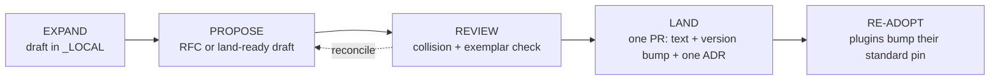

# Standard governance and amendment process

> The committed operating model for the Advanced Skill Library Standard across the product-on-purpose plugin family. It defines how family standards are expanded, how they are promoted into the normative Standard, and where every kind of "standard" the family produces is documented. Promoted out of the gitignored working draft [`../_LOCAL/standards-plan.md`](../_LOCAL/standards-plan.md) (Section 10) so the process itself is a tracked, citable artifact rather than a note that can rot.
>
> This document governs *process*, not plugins. It is normative about how the Standard changes; it does not grade or constrain any plugin (that is `STANDARD.md`'s job). Changes to this document follow the same propose / review / land discipline it describes, recorded as an ADR in [`decisions/`](decisions/).

The key words MUST, MUST NOT, SHOULD, SHOULD NOT, and MAY are used as defined in RFC 2119.

## 1. What this governs

The product-on-purpose family has exactly one normative authoring Standard: **The Advanced Skill Library Standard** (`STANDARD.md`). This document governs:

- how that Standard is **changed** (the amendment lifecycle, Section 5);
- how new standards are **drafted** before they are ready to change it (Section 7);
- **where** each kind of standard the family produces is documented (Section 2);
- the **canonical home** of the Standard and the sequenced move toward it (Section 3, ADR 0001).

It does not govern a plugin's internal design choices. Those are recorded as that plugin's own ADRs (Section 2).

## 2. The three homes (plus this one)

"Standard" means several different things in this family. Each has exactly one home and one format. Putting a concern in the wrong home is what produced the current `CONTRIBUTING.md`-versus-`STANDARD.md` drift.

| Concern | Question it answers | Home | Format |
|---|---|---|---|
| **Authoring Standard** | How is a plugin built inside? | `standards/STANDARD.md` (one normative copy) | RFC-2119 clauses, one canonical version |
| **Listing contract** | What makes a repo listable in the marketplace? | `agent-plugins/CONTRIBUTING.md` (thin) | Binds to the Standard by version, restates nothing |
| **Plugin-specific decisions** | Why did *this* plugin choose X? | each plugin's `docs/internal/decisions/` | MADR ADRs |
| **This operating model** | How does the Standard itself change? | `standards/GOVERNANCE.md` + `standards/decisions/` | This document + MADR ADRs |

The discipline that ties them together is **decouple-and-pin**, the same pattern the marketplace already uses for plugin code:

- the marketplace pins each plugin by `sha`, not by vendoring its code;
- each plugin pins the Standard by **version** (the `library.json` `standard` field), not by copying its text;
- the listing contract pins the Standard by **reference** ("a listed plugin MUST conform at the version in its `library.json`, tier >= Bronze"), not by restating manifest, naming, or versioning rules.

There is exactly **one** normative copy of `STANDARD.md`. No other repo carries a divergent copy, only a pinned version reference. A plugin MUST NOT copy Standard text into itself.

## 3. The canonical home (and where it is today)

**Decision (ADR 0001): the canonical home of the Standard is `agent-plugins/standards/`.** agent-plugins is the family's only neutral, plugin-free repository (it hosts the marketplace registry and the listing contract), which makes it the correct owner of family-level governance. A dedicated standard repository was considered and rejected as premature at the current scale; keeping the Standard permanently inside the `agent-skills-toolkit` plugin was rejected as a category error (a member plugin cannot neutrally own the law it must itself obey). The full reasoning, including the conditions under which a dedicated repository becomes warranted, is in [ADR 0001](decisions/0001-standard-governance-and-home.md).

**Transitional state (as of 2026-06-01).** The move is deliberately sequenced:

- `STANDARD.md` and its enforcing checks physically live in `agent-skills-toolkit/`, where the checks were born and remain entangled with that plugin's own validation.
- This operating model and the Standard's governance ADRs are born here, in `agent-plugins/standards/`, because they are family-level and do not depend on the check relocation.

The remaining relocation, moving `STANDARD.md` text into `standards/STANDARD.md` and extracting the generic, family-wide conformance checks into `standards/checks/` (dovetailing with the shared CI workflow specced in `_LOCAL/astro/ci-standard.md`), lands later as its own deliberate amendment, once that extraction is scoped. Until then, references to the Standard resolve to [`../../agent-skills-toolkit/STANDARD.md`](../../agent-skills-toolkit/STANDARD.md). Adopting the *process* does not wait on the *move*.

## 4. The canonical version

The current version of the Standard is declared in exactly one place: the **version header at the top of `STANDARD.md`** (today: `Standard version 0.8`). Every other mention of a version number, including schema examples, prose, and this document, is illustrative and MUST be treated as non-authoritative. Any inline example that names a concrete version (for example the `library.json` schema example in `STANDARD.md` Section 5.1) MUST be updated in lockstep with the header whenever the version bumps; the LAND checklist (Section 5) enforces the sweep.

> The version-example inconsistency earlier working notes flagged (a Section 5.1 example reading `1.0` against a `0.8` header) is already resolved on disk: Section 5.1 reads `"0.8", the current version`. This section exists to keep it that way: one source of truth, swept at every bump.

## 5. The amendment lifecycle

A change to the Standard moves through five stages. The middle three are the serialized promotion path; the bookends are how work enters and settles.

**EXPAND (Section 7).** New standards begin as working drafts in `_LOCAL/` (gitignored). A draft is exploratory, numberless, and non-authoritative. It carries the proposed RFC-2119 text, a target section *by name*, a rationale grounded in real artifacts, and the affected plugins.

**PROPOSE.** When a draft is ready, it is proposed for landing, at one of two weights:

- *Land-ready draft* (default for a small, self-contained clause): the `_LOCAL` draft goes straight to a LAND pull request.
- *RFC* (for a cross-cutting change, a new convention, or anything contentious): invoke `askit-decision` (rfc mode) to formalize it under the Standard's `rfcs/`; on acceptance it graduates to the ADR the LAND records. This reuses the family's existing RFC-to-ADR machinery rather than inventing a parallel one.

A proposal MUST NOT be ratified from a non-conforming exemplar: a plugin proposing a clause MUST itself satisfy the clauses it already claims, or its proposal waits until it does.

**REVIEW.** The maintainer (optionally a second LLM via the family AI-review flow) checks the proposal for **section collisions**. Two proposals that touch the same section MUST be reconciled into one coordinated edit, not landed as overlapping rules. Provisional section numbers are advisory only (Section 6).

**LAND (serialized, branch-protected).** Edits to `STANDARD.md` go through a **single** pull request on the protected canonical branch that atomically:

1. edits the Standard text;
2. bumps the Standard version exactly once, and sweeps every inline version mention (Section 4);
3. adds exactly **one** ADR to `decisions/` (graduated from the RFC, if any);
4. adds the matching `CHANGELOG.md` / `RELEASE-NOTES.md` entry.

One version bump plus one ADR per landing is invariant.

**RE-ADOPT.** Plugins do not copy the new text. Each bumps its own `library.json` `standard` field to the new version and makes the required conformance edits on its own cadence. The declared `standard` value is the single pin that says which version of the family law a plugin meets; the registry surfaces it (Section 9).

## 6. The allocation invariant (why parallel sessions stop colliding)

Three numbers are **allocated only at LAND time on the protected branch, never reserved in a draft**:

- the **Standard version** (for example `0.8 -> 0.9`),
- the **ADR number** (the next free `NNNN` in `decisions/`),
- the **section number** of any new Standard section.

Because the numbers are taken at the head of the protected branch, two concurrent `_LOCAL` drafts cannot both bake in "bump to 0.9," "ADR 0002," or "Section 13." Whichever pull request lands first takes the numbers; the second MUST rebase onto the new head and re-resolve any same-section overlap. Branch protection requiring up-to-date-before-merge enforces the serialization mechanically. This is the specific mechanism that ends the multi-session collisions the family hit when standards evolved in parallel.

This is why drafts reference sections by **name plus a `(provisional)` number**. The Astro draft's "Section 14" and the cross-plugin draft's "Section 13" are provisional and will be assigned real numbers at land. A draft MUST NOT treat a provisional number as reserved.

## 7. How a standard is drafted (the bundle template)

The best-developed standards body in the family, the Astro documentation-site standard now promoted to [`domains/astro-sites/`](domains/astro-sites/README.md) (refined against the 2026-06-02 implementation audit; the superseded drafts were swept, leaving two evidence docs in `../_LOCAL/astro/` as provenance), is the template for how any new standards domain SHOULD be drafted. It demonstrates the shape:

| Artifact | Role |
|---|---|
| one normative **spec** | the clauses (RFC-2119, severity, target section by name) plus the decisions with full reasoning (e.g. `domains/astro-sites/SITE-STANDARD.md`: clauses 14.x + decisions A-1..A-6) |
| one **rollout-plan** | the sequenced critical path: what converges first, what lands last |
| per-repo **execution docs** | one per affected plugin: file-grounded Before / After / Gaps (P0/P1/P2) / numbered agent steps with acceptance checks |
| supporting **infra specs** | shared machinery the clauses assume (e.g. a CI spec, a shared-preset spec) |
| an **evidence doc** | the verified findings the clauses rest on, so a reviewer can audit the basis |
| a **session-kickoff harness** | makes each execution doc independently dispatchable to a fresh agent session |

A new domain SHOULD be justified the way that cluster was: audit real artifacts, adversarially verify the load-bearing claims, ground the recommendation in upstream documentation, then derive opinionated clauses. A clause without a named **enforcing check** is aspirational, not normative; prefer clauses the conformance spine can verify.

## 8. The current drafting backlog

These standards are drafted in `_LOCAL/` and queued for promotion through Section 5. Section numbers are provisional (Section 6). This list is the index; the drafts hold the text.

| Draft | Target (provisional) | Severity | Source |
|---|---|---|---|
| Shared family writing voice (dash ban) | new Section 8.4 | SHOULD | standards-plan 8.1 |
| Rename / identity continuity | Section 8.2 sub | MUST | standards-plan 8.3 |
| Cross-plugin coupling by version | new Section 13 | MUST | standards-plan 8.2 |
| Migration off embedded marketplaces | Section 12 sub | MUST | standards-plan 8.5 |
| Site-layout + legibility (one coordinated edit) | Section 10 | SHOULD / MUST | standards-plan 8.6 / 8.7, superseded by Astro 14.1 |
| Documentation sites (whole section) | new Section 14 (14.1-14.11) | MUST / SHOULD | [`domains/astro-sites/SITE-STANDARD.md`](domains/astro-sites/SITE-STANDARD.md) |
| Thin listing contract bound by version | `CONTRIBUTING.md` + Section 12 xref | MUST | standards-plan 8.4 |
| Language-agnostic runner | Section 4.1 amendment | MUST | standards-plan D-4 / G-7 |

**Sequencing constraints carried from the drafts:** the language-agnostic runner (D-4) MUST be resolved before the site-layout clause lands, or the Standard ships an internal contradiction; the two Section-10 clauses MUST land as one coordinated edit; and a clause MUST NOT be ratified from a non-conforming exemplar.

## 9. Re-adoption and the registry

After a landing, each plugin re-adopts on its own cadence by bumping its `library.json` `standard` field and making the conformance edits. Two of four family plugins (`pm-skills`, `writing-style-library`) carry no `library.json` yet and so cannot pin the Standard; giving them one is the precondition for them to participate in versioned governance at all. The marketplace registry SHOULD surface each plugin's declared `standard` version and `tier`, so a consumer can see which version of the family law each plugin meets.

## See also

- [`../../agent-skills-toolkit/STANDARD.md`](../../agent-skills-toolkit/STANDARD.md) - the normative authoring Standard (current home, pre-relocation).
- [ADR 0001](decisions/0001-standard-governance-and-home.md) - the home decision and its alternatives.
- [`../_LOCAL/standards-plan.md`](../_LOCAL/standards-plan.md) - the full family analysis this process was promoted from (gitignored working doc).
- `agent-skills-toolkit` `askit-decision` skill - authors MADR ADRs and RFCs in the family format.
